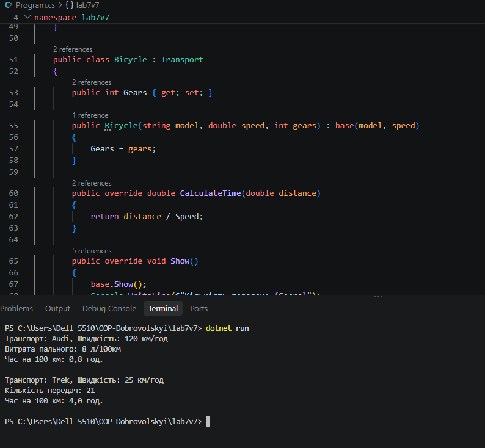

# Лабораторна робота №7 (lab7v7)

**Тема:** Абстрактні класи та інтерфейси  
**Варіант:** 7  

## Опис роботи
У програмі реалізовано абстрактний клас `Transport` та інтерфейс `IInfo`.  
Створено два класи-нащадки `Car` та `Bicycle`, де реалізовано розрахунок часу в дорозі та вивід даних.

## Контрольні запитання

1. **Чим абстрактний клас відрізняється від інтерфейсу?**
   Абстрактний клас може мати реалізований код, поля та конструктор, а інтерфейс задає лише структуру (методи без реалізації).

2. **Чи можна створити об'єкт абстрактного класу?**
   Ні, об'єкт абстрактного класу створити через `new` не можна, лише через його класи-нащадки.

## Результат роботи програми
